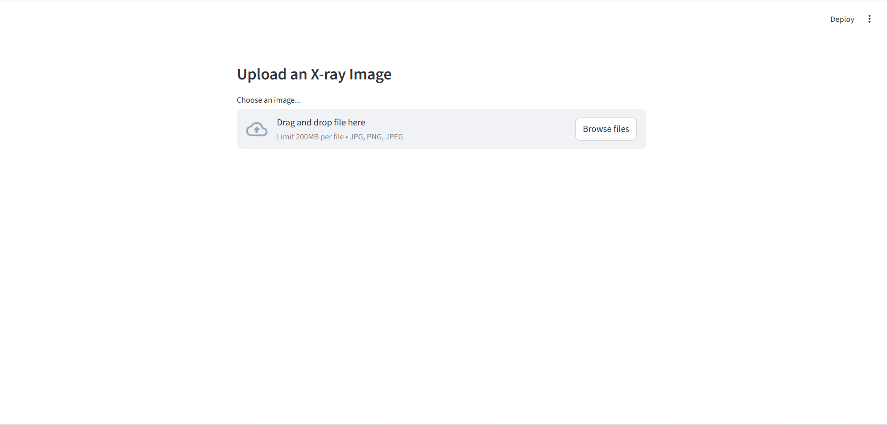
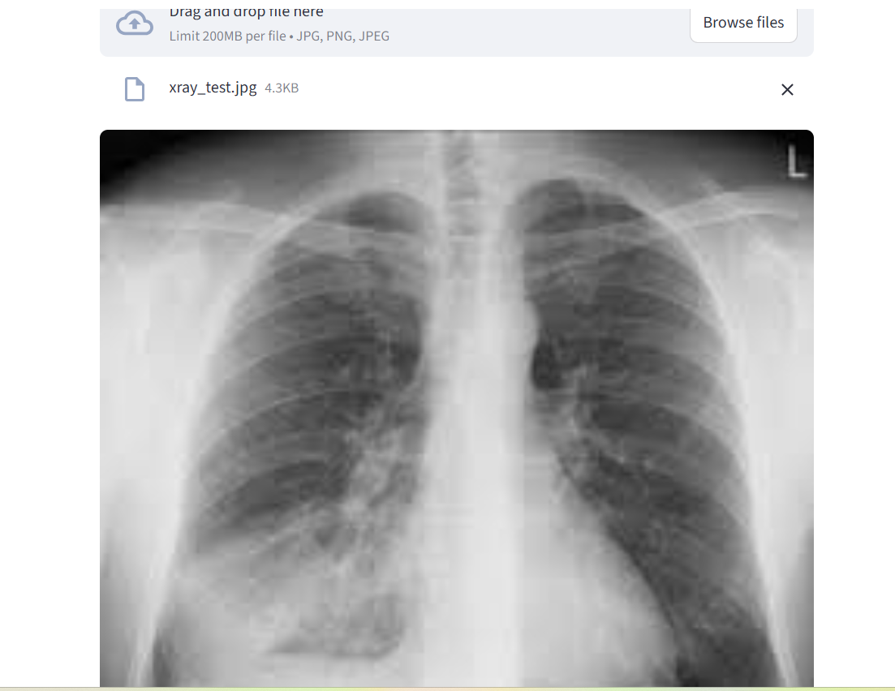
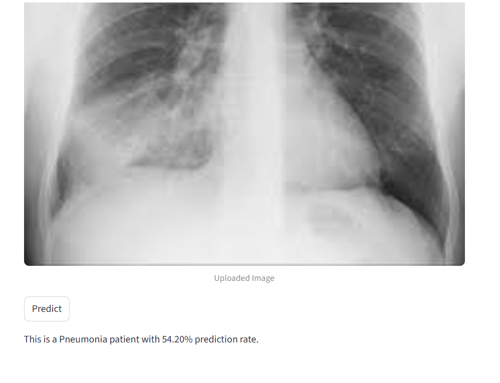

# 🩻 X-ray Pneumonia Detection using Deep Learning

## 📌 Project Overview
This project focuses on **Pneumonia Detection from Chest X-ray Images** using **Deep Learning** techniques. The objective is to classify chest X-ray scans into two categories:

- **Normal**
- **Pneumonia**

Initially, a **Convolutional Neural Network (CNN)** was built **from scratch** to understand the fundamentals of image classification and medical image analysis. Later, a **pretrained deep learning model (Transfer Learning)** was used to improve prediction accuracy and overall performance.

Additionally, a **Streamlit web application** was developed to allow users to upload chest X-ray images and instantly receive predictions.

---

## 🚀 Features
✅ Built a **CNN model from scratch** for X-ray image classification  
✅ Improved performance using a **pretrained model (Transfer Learning)**  
✅ Interactive **Streamlit web application** for real-time predictions  
✅ Upload X-ray images (`jpg`, `jpeg`, `png`) for instant diagnosis  
✅ Clean and simple user interface for easy accessibility  

---

## 🧠 Model Development

### 1. CNN Model from Scratch
A custom **Convolutional Neural Network (CNN)** architecture was designed and trained to classify chest X-ray images.

Key steps:
- Image preprocessing and normalization
- Feature extraction using convolution layers
- Classification using fully connected layers
- Performance evaluation on validation and test datasets

### 2. Transfer Learning (Pretrained Model)
To improve accuracy and generalization, a **pretrained deep learning model** was used.

Benefits:
- Better feature extraction
- Faster convergence
- Improved prediction accuracy
- Reduced overfitting compared to training from scratch

---

## 📂 Project Structure

```text
📦 X-ray-Pneumonia-Detection
│── x_ray_image.py                     # Streamlit web application
│── x_ray_image_model.h5              # Trained model file
│── X_ray_image_classification.ipynb  # Training & experimentation notebook
│── requirements.txt                  # Project dependencies
│── README.md                         # Project documentation
│── screenshots/                      # Application screenshots (optional)
```

---

## ⚙️ Installation

### 1. Clone the Repository
```bash
git clone <[(https://github.com/bishalanand/CNN-x_ray-imageclassification)])>
cd X-ray-Pneumonia-Detection
```

### 2. Install Dependencies
```bash
pip install -r requirements.txt
```

---

## ▶️ Running the Streamlit App

Run the following command inside the project folder:

```bash
streamlit run x_ray_image.py
```

After running the command, Streamlit will generate a local URL (usually):

```text
http://localhost:8501
```

Open it in your browser.

---

## 🖼️ How to Use the Application

1. Open the Streamlit web app.
2. Upload a chest **X-ray image** (`jpg`, `jpeg`, or `png`).
3. Click on the **Predict** button.
4. The model will classify the image as:

- **Normal**
- **Pneumonia**

---

## 🔍 Model Workflow

1. **Image Upload**
2. **Image Preprocessing**
   - Resize image
   - Normalize pixel values
3. **Prediction using Trained Model**
4. **Display Result**

---

## 📊 Technologies Used

- **Python**
- **TensorFlow / Keras**
- **CNN (Convolutional Neural Networks)**
- **Transfer Learning**
- **NumPy**
- **Matplotlib**
- **Streamlit**

---

## 📈 Future Improvements
- Improve prediction confidence score visualization
- Add Grad-CAM for model explainability
- Support multiple pretrained architectures
- Deploy the application online

---

## 📸 Application Screenshots

Add screenshots of your application inside the `screenshots/` folder.





## ⚠️ Disclaimer
This project is developed for **educational and research purposes only** and should **not be used as a replacement for professional medical diagnosis**.

---

## 👨‍💻 Author
**Bishal Anand**

Interested in **AI, Machine Learning, Deep Learning, and LLMs**.
